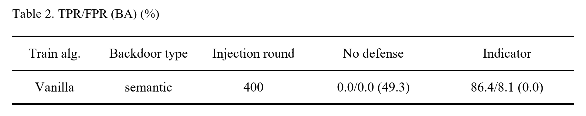
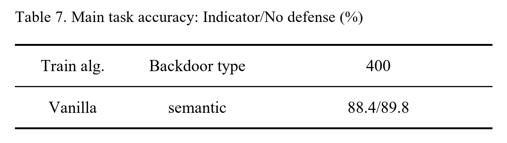

# BackdoorIndicator：联邦学习后门防御复现报告

> 论文：**BackdoorIndicator: Leveraging OOD Data for Proactive Backdoor Detection in Federated Learning**（USENIX Security 2024）  
> 作者：Songze Li、Yanbo Dai  
> 论文页面：[USENIX Security 2024](https://www.usenix.org/conference/usenixsecurity24/presentation/li-songze)  
> 官方代码：[ybdai7/Backdoor-indicator-defense](https://github.com/ybdai7/Backdoor-indicator-defense)  
> 复现者：刘明鑫

## 1. 复现工作概述

本项目复现论文提出的联邦学习主动后门检测方法 **BackdoorIndicator**。方法利用分布外（Out-of-Distribution，OOD）数据向全局模型注入指示任务，再检查客户端本地训练后该任务是否仍被保留，从而在不知道后门类型、触发器和目标标签的情况下识别恶意更新。

本次复现已完成论文 Table 2 和 Table 7 中 **CIFAR-10、ResNet18、单恶意客户端、Vanilla 训练算法、semantic 后门、400 轮阶段**这一组实验，并与不使用防御的结果进行对照。已完成的工作包括：

- 刚开始运行了1200轮干净模型，分别保存了第400轮、800轮和1200轮，从生成的主任务准确率曲线图可以看出到400轮之后，主任务准确率趋于稳定。所以之后从同一第 400 轮干净模型出发，分别运行 No defense 和 Indicator 两组实验；
- 攻击者在第 410-659 轮连续上传 250 个语义后门更新；
- 使用 CIFAR-100 的 800 个样本构造指标数据集；
- 统计TPR、FPR、后门准确率和主任务准确率；
- 合并因恢复训练产生的多段日志，并以日志中同轮最后一条全局模型记录为准；
- 生成可直接核对的表格。

本次实验的主要配置如下。

| 项目 | 本次复现设置 |
|---|---|
| 主任务数据集 | CIFAR-10 |
| OOD 数据源 | CIFAR-100 |
| OOD 样本数 | 800 |
| 模型 | ResNet18 |
| 聚合 | `FedProx` 客户端实现，`Fedprox_mu=0`，等价于 FedAvg |
| 数据划分 | Dirichlet non-IID，`alpha=0.9` |
| 客户端总数 / 每轮参与数 | 100 / 10 |
| 每轮恶意客户端数 | 1（攻击期间） |
| 攻击算法 / 后门类型 | Vanilla / semantic |
| 干净模型阶段 | 第 400 轮 checkpoint |
| 指示任务开始轮 | 400 |
| 后门攻击区间 | 410-659，共 250 轮 |
| 良性本地训练 | 2 次，学习率 0.1 |
| 恶意本地训练 | 10 次，学习率 0.025 |
| 指标注入训练 | 每轮 200 次，学习率 0.005 |
| `watermarking_mu` | 0.4 |
| 检测阈值 | 95% |
| 评价轮 | 659 |

## 2. 方法简述

### 2.1 威胁模型

联邦学习服务器在每个通信轮选择部分客户端，下发全局模型并聚合客户端返回的本地更新。恶意客户端通过混合正常样本和后门样本训练本地模型，使全局模型在遇到特定语义触发特征时输出攻击者指定标签，同时尽量维持正常样本上的准确率。

本实验采用论文中的 semantic backdoor：从 CIFAR-10 中选择具有特定自然语义特征的汽车图像作为后门样本，并将其目标标签设为类别 2。此类触发器不需要人工覆盖像素图案，更接近自然出现的输入特征。

### 2.2 BackdoorIndicator

BackdoorIndicator 的关键观察是：后门样本相对于目标类别的正常数据本质上属于 OOD 数据，而后续学习到同一目标标签的后门任务可能维持此前的 OOD 映射。服务器据此执行以下流程：

1. 从 CIFAR-100 采样 OOD 图像并随机赋予 CIFAR-10 标签，构造指示数据集；
2. 每轮训练开始前，在全局模型上注入指示任务，并用距离正则项限制模型偏移；
3. 保存注入前后的 Batch Normalization（BN）统计量，将注入前的 BN 统计量用于下发模型，减少指标任务对主任务的影响；
4. 客户端完成正常或恶意本地训练并上传更新；
5. 服务器恢复指示任务对应的 BN 统计量，逐标签测试指标准确率；
6. 如果某个标签的最高指标准确率超过阈值，则将该客户端更新判为恶意并从聚合中排除。

该设计从模型行为而非单纯参数距离判断后门。它不要求服务器预先知道攻击所用的触发器、后门类型或目标标签。

### 2.3 评价指标

- **TPR（True Positive Rate）**：正确识别的恶意更新数 / 恶意更新总数；
- **FPR（False Positive Rate）**：被误判为恶意的良性更新数 / 良性更新总数；
- **BA（Backdoor Accuracy）**：攻击结束时，全局模型在后门测试任务上的准确率；
- **Main task accuracy**：全局模型在 CIFAR-10 正常测试集上的准确率。

Table 2 使用 `TPR/FPR (BA)`，数值越理想通常表现为 TPR 高、FPR 和 BA 低；Table 7 使用 `Indicator/No defense`，用于判断防御是否明显降低主任务性能。

## 3. 复现结果与分析

### 3.1 Table 2：后门检测与抑制效果



| 结果来源 | No defense | Indicator |
|---|---:|---:|
| 论文 Table 2 | 0.0/0.0 (46.2) | 72.3/26.0 (0.0) |
| 本次复现，第 659 轮 | 0.0/0.0 (49.3) | **86.4/8.1 (0.0)** |

本次 Indicator 实验累计处理 250 个恶意更新和 2350 个良性更新：

- TP = 216，FN = 34，因此 `TPR = 216 / 250 = 86.4%`；
- TN = 2159，FP = 191，因此 `FPR = 191 / 2350 = 8.13%`，表中保留一位小数为 8.1%；
- 第 659 轮 Indicator 的 BA 为 0.0%，No defense 的 BA 为 49.32%。

结果复现了论文的核心结论：不使用防御时语义后门仍保持较高成功率，而 BackdoorIndicator 能过滤大部分恶意更新，并在攻击结束时将后门准确率压制到 0。此次单次运行的 TPR 和 FPR 均优于论文中该单元格的数值，但两组设置并非严格同分布重复实验。

### 3.2 Table 7：主任务准确率



| 结果来源 | Indicator / No defense |
|---|---:|
| 论文 Table 7 | 82.3 / 82.1 |
| 本次复现，第 659 轮 | **88.4 / 89.8** |

本次复现中，Indicator 的主任务准确率为 88.40%，No defense 为 89.75%，防御带来的组间差值为 -1.35 个百分点。它在显著压低 BA 的同时保留了接近无防御组的正常分类能力，与论文关于“指标任务不会明显损害主任务性能”的结论一致。

### 3.3 结果产物与统计口径

结果由根目录脚本 `generate_paper_tables.py` 从以下四段日志读取：

| 实验组 | 日志分段 |
|---|---|
| No defense | `saved_models/Sep.02_12.11.55/log.txt`、`saved_models/Sep.02_21.59.50/log.txt` |
| Indicator | `saved_models/Sep.03_17.17.39/log.txt`、`saved_models/Sep.05_17.26.11/log.txt` |

恢复训练会使两个日志分段包含相同轮次，Indicator 在指标注入及 BN 替换过程中也会多次记录同轮准确率。统计脚本按给定日志顺序覆盖重复项，对每个轮次、每种准确率保留最后一条 `global model` 记录；检测计数是累计快照，不对多个快照求和。Table 2 和 Table 7 均固定使用攻击结束轮 659 的结果。

生成文件包括：
- `saved_models/generated_tables/table2_vanilla_semantic_400.png`
- `saved_models/generated_tables/table7_vanilla_semantic_400.png`

## 4. 快速启动指南

### 4.1 环境准备

官方实现使用 Python 3.7.15、PyTorch 1.13.0 和 torchvision 0.14.0。代码在模型和数据处理中直接调用 CUDA，因此完整训练需要 NVIDIA GPU 和可用的 CUDA 环境。

```bash
conda create -n backdoor-indicator python=3.7.15
conda activate backdoor-indicator
pip install torch==1.13.0 torchvision==0.14.0
pip install -r requirement.txt
```

CIFAR-10 和 CIFAR-100 默认通过 torchvision 下载至 `data/`。本仓库已包含相应数据文件时会直接复用。

### 4.2 训练干净模型

首先关闭攻击和指标注入，训练并保存第 400 轮干净全局模型：

```bash
python main.py --GPU_id "0" --params utils/yamls/params_baseline.yaml
```

每次运行都会在 `saved_models/<运行时间>/` 下生成 `params.yaml`、`log.txt`、checkpoint 和准确率曲线。找到 `saved_model_global_model_400.pt.tar` 后，将两组实验配置中的 `resumed_model` 指向该 checkpoint。加载 checkpoint 时，代码会用 checkpoint 内的轮次覆盖 YAML 中的 `start_round`。

### 4.3 运行 No defense 对照组

确认 `utils/yamls/params_vanilla_noIndicator.yaml` 满足以下关键设置：

```yaml
resumed_model: "<干净模型目录>/saved_model_global_model_400.pt.tar"
defense_method: nodefense
poisoned_start_round: 410
poisoned_end_round: 660
global_watermarking_start_round: 10000
end_round: 760
```

然后运行：

```bash
python main.py --GPU_id "0" --params utils/yamls/params_vanilla_noIndicator.yaml
```

### 4.4 运行 BackdoorIndicator

确认 `utils/yamls/indicator/params_vanilla_Indicator_400 copy.yaml` 中的 `resumed_model` 同样指向第 400 轮干净 checkpoint，并保留：

```yaml
defense_method: Indicator
global_watermarking_start_round: 400
poisoned_start_round: 410
poisoned_end_round: 660
VWM_detection_threshold: 95
end_round: 760
```

然后运行：

```bash
python main.py --GPU_id "0" --params "utils/yamls/indicator/params_vanilla_Indicator_400 copy.yaml"
```

当前仓库中的两个 YAML 已指向续训 checkpoint，用于完成已有长时间实验。如果需要从第 400 轮完整重跑，必须先按上述说明改回同一个干净 checkpoint。

### 4.5 生成论文表格

编辑 `generate_paper_tables.py` 顶部的 `LOGS`，填入新实验生成的日志目录，然后运行：

```bash
python generate_paper_tables.py
```

PNG 绘制依赖 Pillow；如当前环境未安装，可执行：

```bash
pip install Pillow
```

脚本会重新生成 CSV、Markdown 和 PNG

## 5. 遇到的困难及解决办法

### 5.1 完整实验耗时较长，训练需要中断后恢复

**困难：** 实验首先需要训练 1200 轮干净模型，随后还要分别运行 No defense 和 Indicator。Indicator 每个通信轮还包含 200 次服务端指示任务训练，整体耗时很长，难以保证一次运行完成。本次实验因此产生了多段续训日志。

**解决办法：** 使用项目自带的 checkpoint 机制保存中间模型。No defense 在第 600 轮 checkpoint 上继续训练，Indicator 在第 700 轮 checkpoint 上继续训练。加载 checkpoint 时，`AbstractServer._resume_model()` 会读取其中保存的 `round` 并覆盖 YAML 的 `start_round`，因此恢复前需要检查终端中的 `Loaded params from saved model ... current round is ...`，确认实际起始轮次正确。

### 5.2 恢复训练造成重复轮次，Indicator 同轮还有多条准确率

**困难：** checkpoint 保存的轮次会在恢复训练时再次执行，所以相邻日志之间存在重复轮次。Indicator 在注入指示任务、替换 BN 统计量和完成客户端聚合时还会多次测试全局模型，同一个轮次可能出现多条 `benign acc` 和 `poisoned acc`。若简单取第一条、求平均或直接拼接日志，会得到错误的 Table 2 和 Table 7 数值。

**解决办法：** 编写 `generate_paper_tables.py`，按照实际训练顺序合并日志。脚本以 `(轮次, 指标类型)` 为键保存全局模型准确率，遇到相同键时用后面的记录覆盖前面的记录，因此最终保留该轮训练完成后的最后一次全局模型结果。脚本只匹配 `global model on round`，忽略本地模型测试和指示任务内部的 `round:199` 等记录；累计检测快照也只取目标轮次，不对多个快照相加。

### 5.3 防御开始轮与攻击开始轮不同，FPR 口径容易误解

**困难：** Indicator 从第 400 轮开始运行，而攻击从第 410 轮开始。服务器的检测计数器从第 400 轮便开始累计，因此第 659 轮日志中的 FPR 分母为 2350，而不是只计算攻击期间得到的 2250。攻击前第 400-409 轮已经处理了 100 个良性更新，其中误报了 13 个。

**解决办法：** 本报告的 Table 2 与原程序日志口径保持一致，使用第 659 轮累计值 `191 / 2350 = 8.13%`，记为 8.1%。如果只分析第 410-659 轮攻击窗口，则需要同时扣除攻击前的分子和分母，得到 `(191 - 13) / (2350 - 100) = 178 / 2250 = 7.91%`，而不能直接计算 `191 / 2250`。报告采用哪种口径都应明确说明时间范围。

### 5.4 原项目没有直接生成论文格式表格

**困难：** 原程序主要输出训练日志、checkpoint 和准确率曲线，Table 2 所需的 TPR/FPR (BA) 与 Table 7 所需的 Indicator/No defense 需要人工从不同日志位置整理。人工统计不仅容易混淆 benign acc 和 poisoned acc，也难以稳定处理续训产生的重复记录。

**解决办法：** 增加 `generate_paper_tables.py`，自动读取四段日志、检查计数一致性并生成 PNG。

## 6. 可复现性与限制说明

1. 本仓库目前复现的是论文 Table 2、Table 7 的一个实验单元格，不代表已经复现论文中的全部攻击算法、后门类型、模型、数据集和基线防御。
2. `main.py` 中 PyTorch、NumPy 和 Python 随机种子的设置被注释。本报告基于现有的一次运行，而论文表格是作者实验设置下的结果，因此客户端采样、Dirichlet 划分、数据增强和 OOD 标签都会引入随机差异。
3. FPR 的分母 2350 来自第 400-659 轮的累计良性客户端计数，其中包括攻击开始前第 400-409 轮的 100 个良性更新。这与日志中服务器的累计计数口径保持一致。
4. 两组长时间训练都曾从 checkpoint 恢复。分析脚本已经处理重复轮次，但若希望获得严格可重复的统计结果，建议固定随机种子，并在同一软硬件环境下从同一干净 checkpoint 分别完整运行两组实验。

## 7. 项目结构

```text
.
├── main.py                         # 联邦训练入口
├── generate_paper_tables.py        # 合并日志并生成 Table 2 / Table 7
├── dataloader/                     # CIFAR、EMNIST、OOD 数据与 non-IID 划分
├── models/                         # ResNet、VGG 等模型
├── participants/
│   ├── clients/                    # 良性及恶意客户端训练逻辑
│   └── servers/                    # Indicator 与各基线防御服务器
├── utils/yamls/                    # 不同攻击、防御和训练阶段配置
├── data/                           # 本地数据集
└── saved_models/
    ├── <运行时间>/                 # checkpoint、参数、日志与准确率曲线
    └── generated_tables/           # 本次报告使用的表格结果
```
## 8. 方法解决的问题、局限与可行改进

### 8.1 方法解决的问题

BackdoorIndicator 主要解决非 IID 联邦学习中隐蔽后门客户端难以识别的问题。传统防御通常依据更新范数、参数距离或客户端之间的相似度发现异常；但非 IID 数据会使正常更新本身存在较大差异，而攻击者还可以通过降低恶意学习率，使恶意更新在统计上更接近正常更新。因此，传统方法容易误判正常客户端或漏检恶意客户端。

该方法由服务器主动使用 OOD 数据向全局模型植入指示任务，再检查客户端本地训练后是否保留该任务。正常训练通常会削弱指示任务映射，后门训练则可能继续保留它。服务器据此在聚合前识别并过滤可疑更新，将检测依据从客户端更新的固有统计特征扩展为服务器主动构造的模型行为特征，同时不需要预先知道后门触发器、后门类型和目标标签。

### 8.2 方法本身的不足

1. **正常客户端仍可能被误判。** 误报会排除有效更新，减少参与聚合的数据；如果被排除的客户端具有样本较少或较特殊的数据分布，全局模型对这些少数数据特征的学习能力也会下降。
2. **恶意客户端仍可能漏检。** 论文部分设置及自适应攻击实验中的检出率并不理想，漏检更新进入聚合后仍可能维持全局模型中的后门。
3. **检测阈值固定。** 客户端检测得分会随训练阶段、非 IID 程度和攻击方式变化，固定阈值过高会增加漏检，过低则会增加误报，更换实验环境时还需要重新调参。
4. **检测效果依赖 OOD 数据。** OOD 数据来源和样本数量会影响检测得分的区分度，选择不合适时可能同时影响检出率和误报率。
5. **服务器存在额外开销。** 服务器需要训练指示任务并逐一测试客户端模型，客户端数量或模型规模增加后，训练时间和计算成本也会增加。
6. **需要访问单个客户端模型。** 方法不能直接用于服务器只能看到聚合结果的安全聚合环境。

### 8.3 可行的改进方向

主线是将**动态阈值**与**历史多轮判断**组合为一个自适应检测方法：

1. 每轮记录各客户端的指示任务检测得分，使用中位数、离散程度或分位数估计当轮正常得分范围，自动生成检测阈值，以改善固定阈值在不同训练阶段和非 IID 程度下的适应性。
2. 为每个客户端维护历史风险分数，综合其多次参与训练时的检测结果；对偶发异常的客户端继续观察，对连续异常或长期高风险客户端再降低聚合权重或拒绝聚合，以减少单轮波动造成的误判。
3. 在上述方法基础上，可以进一步减少指示任务训练次数或设置提前停止条件，在保持检测效果的同时降低服务器开销。
4. 如果需要扩展方法，还可以对可疑客户端增加范数或相似度复检，构成**两阶段检测**，但会增加实现和实验复杂度。

动态阈值针对原方法的固定阈值问题，历史多轮判断针对单轮检测不稳定及正常客户端误报问题，轻量化训练针对服务器计算开销问题。
